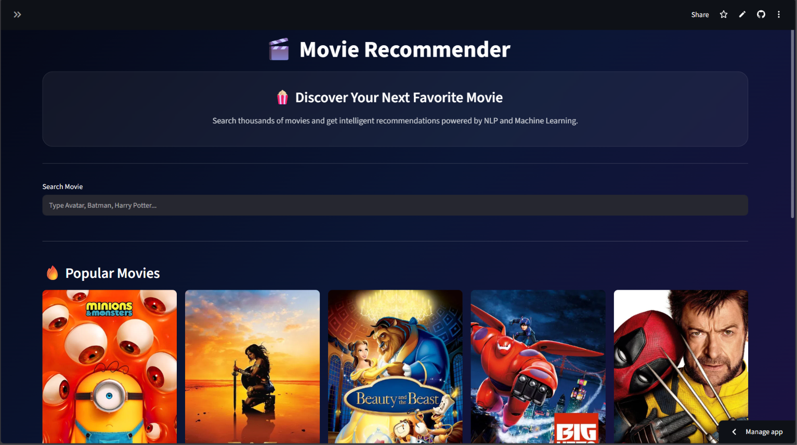
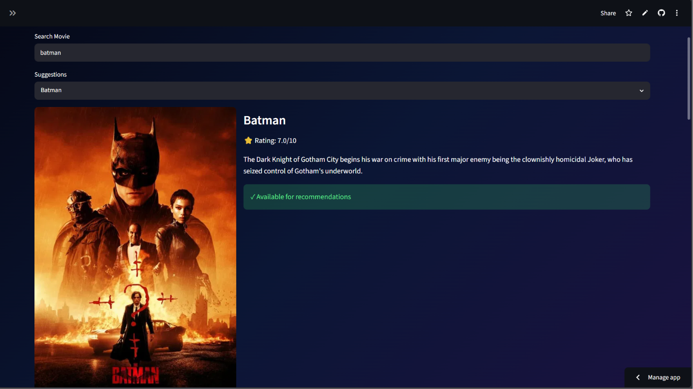
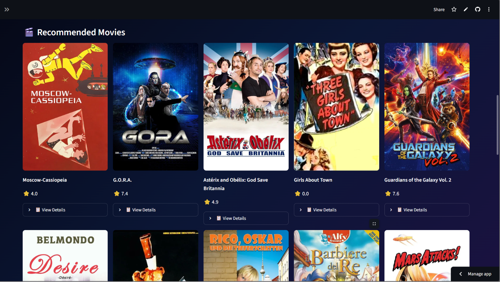

# 🎬 Movie Recommender System

A content-based movie recommendation system built using ML, NLP, TF-IDF Vectorization, Cosine Similarity, Streamlit, and TMDB API.

## 🚀 Live Demo

[🎬 Try the Movie Recommender](https://movie-recommender-597fgqypxxcns2mmvpeaqf.streamlit.app/)

## 📂 GitHub Repository
[GitHub Repository](https://github.com/prachishr/movie-recommender)

## Features

* Movie search with suggestions
* TMDB poster integration
* Movie overview and ratings
* Content-based recommendations
* Popular Movies section
* Top Rated Movies section
* Modern Streamlit UI

## 📸 Screenshots

### Home Page

### Search Results

### Recommendations

## Technologies Used

* Python
* Machine Learning (Scikit-Learn)
* Natural Language Processing (NLP)
* TF-IDF Vectorization
* Cosine Similarity
* Streamlit
* TMDB API
* Pandas
* NumPy

## How it Works

1. Movie descriptions are preprocessed using NLP.
2. TF-IDF vectorization converts text into numerical vectors.
3. Cosine similarity finds similar movies.
4. Streamlit provides an interactive UI.

## Author

Prachi Sharma
